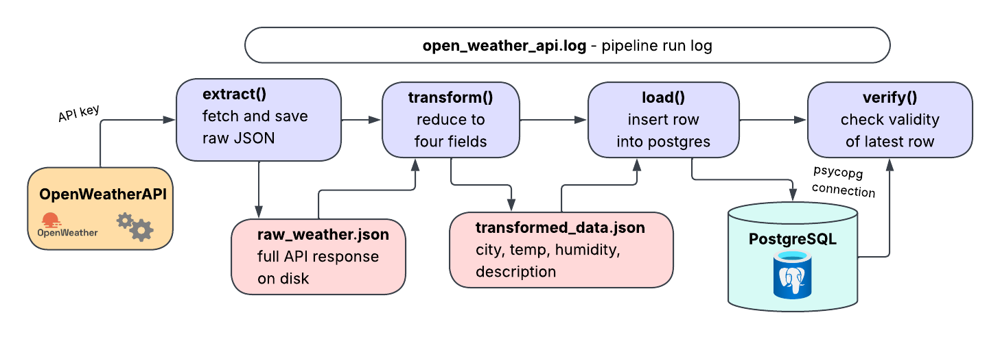

# OpenWeather ETL Pipeline

This is a small ETL pipeline that extracts live weather data for Stockholm from the [OpenWeather](https://openweathermap.org) REST API and transforms it, before loading it into a PostgreSQL database. Finally, a verification step checks the validity of the latest record to confirm the load succeeded.

### Pipeline Overview 

Usting separation of concerns, the pipeline runs as four sequential stages, all orchestrated by `pipeline.py`. 

### Concepts Covered
- ETL pipeline design
- REST API integration
- Data transformation
- Database operations
- Error handling
- Data verification
- Logging
- Environment based configuration

### Setup
Clone the repository and create (and activate) a virtual environment:  
`python -m venv .venv`  
`source .venv/bin/activate`

Install the packages listed in `requirements.txt`:  
`pip install -r requirements.txt`

Create an `.env`file in the root folder:  
`OPENWEATHER_API_KEY=your_api_key`
`DB_PASSWORD=your_database_password`

Don't forget to include the `.env` file in the `.gitignore`!

A PostgreSQL database named `weather_analytics` is required. Create the `weather_data` table by running `schema.sql` (see file for instructions).

### Running the Pipeline
Run: `python pipeline.py`  
The following steps will be executed:  
1. __Extract__: `extract.py` loads OPENWEATHER_API_KEY, calls OpenWeather endpoint with Stockholm coordinates, and dumps JSON response to raw_weather.json. HTTP errors and connection errors are distinguished and logged before re-raising.
2. __Transform__: `transform.py` extracts city, temperature, humidity, and description from raw_weather.json, writing the simplified data to transformed_data.json while handling errors.
3. __Load__: `load.py` reads transformed_data.json, connects to the weather_analytics PostgreSQL database, and inserts data into the weather_data table. Distinguishes connection failures from other database errors.
4. __Verify__: `verify.py` reconnects to the database, checks that the table contains data, retrieves the most recent row, and validates the city, temperature, and humidity values.

All logging is written to both a local log file and the terminal.

### Known Limitations
The purpose of this small but structured project is to acquire a practical understanding of using APIs and integrating them into an ETL pipeline. Moving forward, configuration, resilience, and testing can be improved. 
