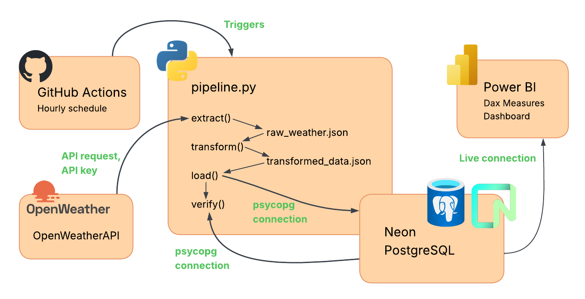
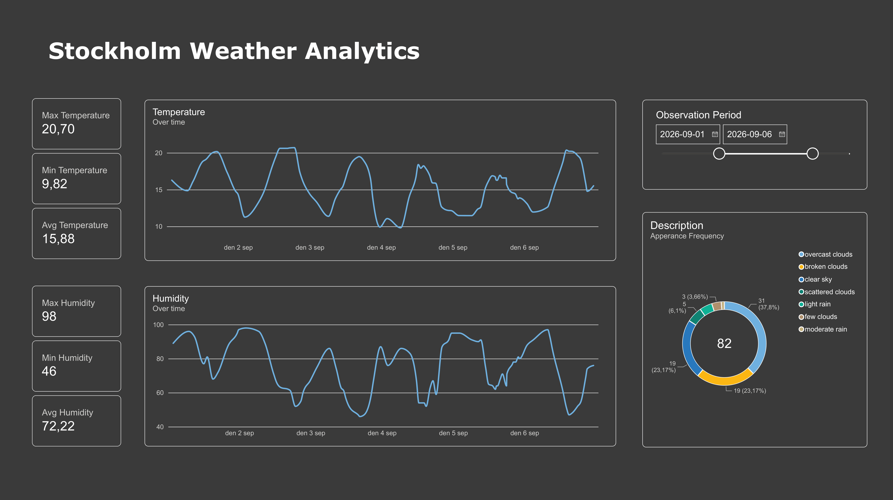

# OpenWeather ETL Pipeline

This is an ETL pipeline that extracts live weather data for Stockholm from the OpenWeather REST API and transforms it, before loading it into a cloud-hosted PostgreSQL database. A verification step checks the validity of the latest record to confirm the load succeeded. The pipeline runs automatically on an hourly schedule via GitHub Actions, and the accumulated data is visualized in a Power BI dashboard.

### Concepts Covered
- ETL pipeline design
- REST API integration
- Data transformation
- Database operations
- Error handling
- Data verification
- Logging
- Environment-based configuration
- Automated testing (pytest, mocking, coverage)
- CI/CD and scheduled automation (GitHub Actions)
- Data visualization (Power BI)

### Dashboard & Key Insights
Accumulated Stockholm weather data, over a 10 day period, is visualized in a Power BI dashboard connected directly to the Neon database, showing temperature and humidity trends, summary statistics, and a breakdown of weather condition frequency. The key findings are:
- Temperature and humidity showed an inverse pattern with temperature peaks aligning with a humidity drop, and vice versa.
- Overcast clouds dominated as the most frequent weather condition recorded

### Setup & Usage
Clone the repository, create and activate a virtual environment:  
`python -m venv .venv`  
`source .venv/bin/activate`

Install the packages listed in `requirements.txt`:  
`pip install -r requirements.txt`

Create an `.env` file:  
`OPENWEATHER_API_KEY=your_api_key`  
`CITY_LAT=desired_city_latitude`  
`CITY_LON=desired_city_longitude`  
`DB_HOST=your_database_host`  
`DB_PORT=5432`  
`DB_NAME=weather_analytics`  
`DB_USER=your_database_user`  
`DB_PASSWORD=your_database_password`  
Include the `.env` file in the `.gitignore`.

Create the `weather_data` table by running `db/schema.sql` against the PostgreSQL instance (this project uses [Neon](https://neon.tech)).

Run the pipeline: `python src/pipeline.py` to execute extract -> transform -> load -> verify in sequence, logging to both local log file and terminal.

### Automation & Testing
The pipeline is scheduled to run every hour via GitHub Actions (`scheduled-pipeline.yml`), and the test suite runs on every push/PR (`tests.yml`). Both require the `.env` variables above set as [GitHub Secrets](https://docs.github.com/en/actions/security-guides/encrypted-secrets).

All external calls (the API and database) are mocked, so tests run without real credentials. Run tests locally with:  
`pip install -r requirements-dev.txt`  
`pytest --cov=src tests/`

### Known Limitations
The project provides hands-on experience with a small data pipeline lifecycle. Limitations include:
- GitHub Actions' scheduled triggers are best-effort and runs roughly 10-15 times per day instead of the 24 hourly times
- The pipeline only supports collecting data from a single city and does not support multiple cities in one run
- The tests only cover the success path, meaning error-handling branches and edge cases are not tested